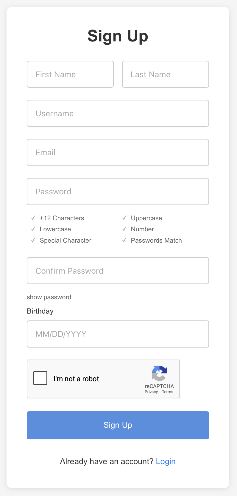
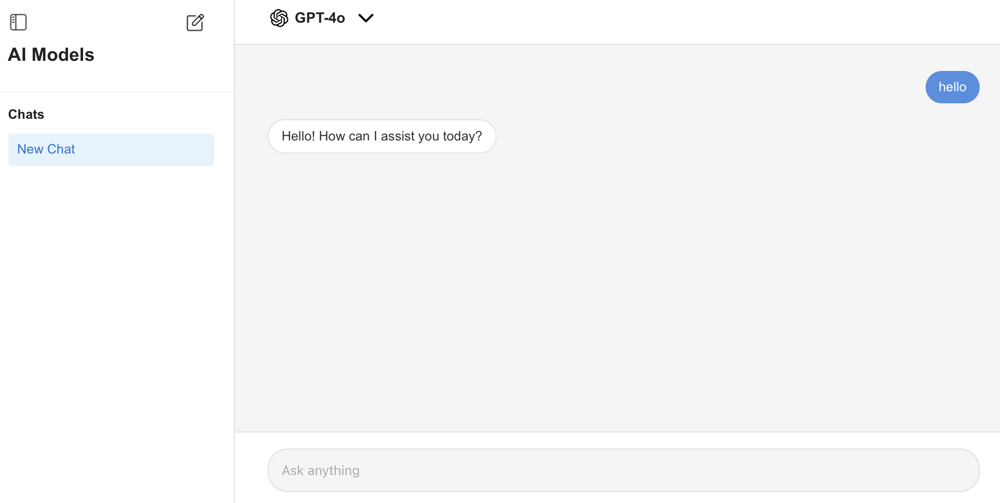

<h1 align="center"> Happy holidays, I'm Jesus </h1>
  
  

    <code>Software Engineer & Data Analyst</code>
  

  

<h1 align="center"> What I'm Currently Working On  </h1>

 <b>Building a fully functional authentication system</b> for Saas  
 <b>Building an All-in-One AI Hub</b> where users can access every model in one place  
 <b>Creating an AI-powered Chrome Extension</b> for enhancing productivity for students  

--- 

<h1 align="center"> Tech: </h1>

<h2 align="center">Programming Languages</h2>

          

<h2 align="center">Frameworks & Libraries</h2>

        

<h2 align="center">Databases</h2>

   

<h2 align="center">Tools & Platforms</h2>

        

<!-- Proudly created with GPRM ( https://gprm.itsvg.in ) -->

<h1 align="center"> Projects: </h1>

  <table>
    <tr>
      <td width="320">
        <h2> Full-Stack Auth System</h2>
        

          
        

      </td>
      <td>
        
A secure authentication system built with React, Node.js, and PostgreSQL

        <ul>
          <li>Google reCAPTCHA for bot protection</li>
          <li>User registration with email verification</li>
          <li>Password reset functionality with security questions</li>
          <li>Password strength feedback</li>
          <li>Protected routes & session management</li>
        </ul>
      </td>
    </tr>
  </table>

  <table>
    <tr>
      <td width="320">
        <h2>AI Models Website</h2>
        
      </td>
      <td>
        
AI platform that brings the top 10 leading AI models together in one place

        <ul>
          <li>Side-by-side chat with multiple AI models</li>
          <li>Instant answers for school, research, and productivity</li>
          <li>Easily compare different models</li>
          <li>Clean and user-friendly interface</li>
          <li>Centralized AI model hub</li>
        </ul>
      </td>
    </tr>
  </table>

